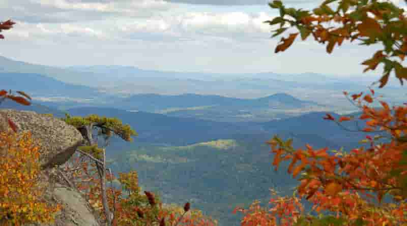

# Introduction {-}

Blablabla


# Some \LaTeX{} Examples {-}

Use section and subsection commands to organize your document. \LaTeX{} handles all the formatting and numbering automatically. Use ref and label commands for cross-references.

## Figures and Tables {-}

Use the table and tabular commands for basic tables --- see Table \@ref(tab:widgets), for example. You can upload a figure (JPEG, PNG or PDF) using the project menu. To include it in your document, use the includegraphics command as in the code for Figure \@ref(fig:view) below.


<!-- 2. The RMarkdown way -->

```{r view, out.width = "100%", fig.cap = "An example image.", echo = FALSE}

```


Item     Quantity
------- ---------
Widgets        42
Gadgets        13

Table: (\#tab:widgets) An Example Table.

## Citations {-}

LaTeX formats citations and references automatically using the bibliography records in your .bib file, which you can edit via the project menu. Use this command for an inline citation, like @pourret_open_2020 , and the this command for a citation in parentheses [@pourret_open_2020].


## Lists {-}

You can make lists with automatic numbering \dots


1. Like this,
1. and like this.

or bullet points...

- Like this,
- and like this.

or with descriptions...

- **Word** Definition
- **Concept** Explanation
- **Idea** Text


We hope you find write\LaTeX\ useful for your PeerJ submission, and please let us know if you have any feedback. Further examples with dummy text are included in the following pages.

# Methods {-}

\paragraph{Example} Creation of the initial database by Doug? What was the method? Year? And after that, update of this database in 2021. **All data for journals not indexed in DOAJ were acquired manually**
\paragraph{} Extraction of journals from the DOAJ by searching in the keywords "archaeo", "archeo", "prehist" and "anthropo". For this last term, we checked it was effectively physical/biological/evolutionary anthropology.
\paragraph{} Method for JIF, CiteScore etc. ?

# Results {-}

## Article processing charges and journal impact factor {-}

- Graphic bars distribution of APC for all journal having gold OA option (including APC = 0$) 
- Plot APC x JIF

*Journal figures:*
Journal Impact Factor (JIF) which is calculated on the two last complete years
5 year JIF: same but on 5 years
Scopus CiteScore = JIF over 4 years (standard JIF is 2 years) (https://service.elsevier.com/app/answers/detail/a_id/14880/supporthub/scopus/)
Scopus SCImago Journal Rank (SJR) integrate the prestige of the citation's journal ! (https://service.elsevier.com/app/answers/detail/a_id/14883/supporthub/scopus/)
Scopus Source Normalized Impact per Paper (SNIP) (https://service.elsevier.com/app/answers/detail/a_id/14884/supporthub/scopus/related/1/)


```{r results, fig.width = 5, fig.height = 4, out.width = "100%", fig.cap = "In-text Picture", echo = FALSE}
time = seq(1.5, 8, 0.1)
plot(time, sin(time), type = "l", xlab = "time [s]", ylab = "amplitude [m]", 
     cex.main = 2, col = "blue", lwd = 3, font = 2, font.main = 2)
```

Reference to Figure \@ref(fig:results).


## Open Access policy {-}

Based on data from SHERPA/RoMEO (new version, no more colours...)

## One or two journals examples {-}

The change towards OA for some big journals, maybe better from different publishers (JAS for Elsevier and the creation of JASReports? Antiquity for Cambridge? AJPA for Wiley? Journal of Archaeological Method and Theory
 for Springer (the biggest Wiley in the GScholar h5 values))

# Discussion {-}

# Conclusion {-}

# Acknowledgments {-}

The authors would like to thank XXX and YYY. 

# References
